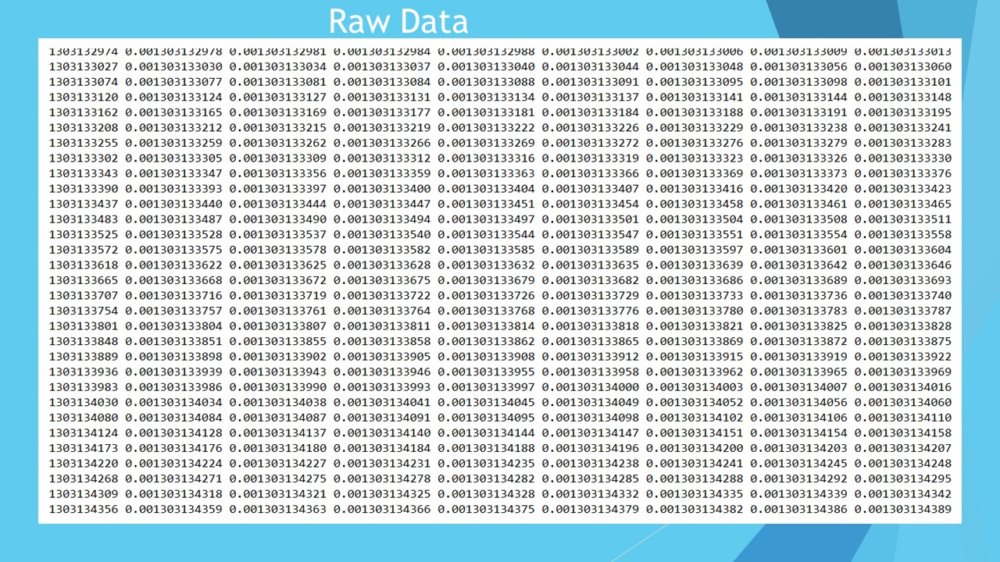
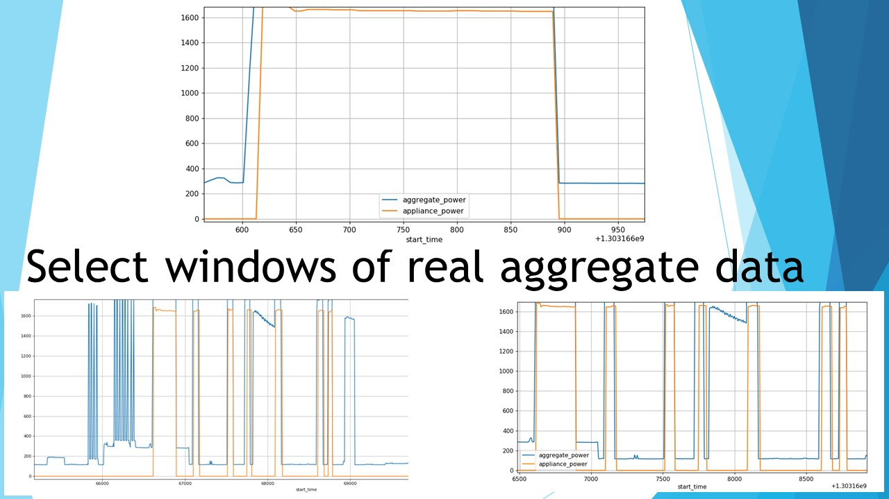

# Neural NILM: Deep Neural Networks Applied to Energy Disaggregation
## Field of research: Machine learning approaches for NILM (Nonintrusive load monitoring)
# Presented by: Yuzhe Lim

---

---

---

---

---

---

---

---

---

---

---

---

---

---

---

---

---

---

---

---

---

---

---

---

---

---

---

---

---

---

---

---

